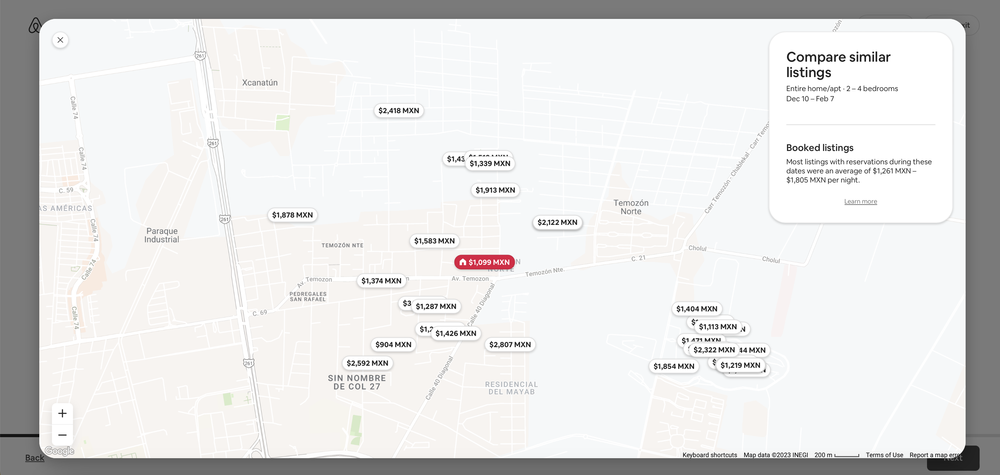

# Machine Learning Airbnb Pricing in Mexico City! 

Project where we create and deploy a TensorFlow Machine Learning model for pricing recommendations on Mexico City's new Airbnb listings!

## Inspiration story

My grandparents remodeled a house and placed it on Airbnb. How did they select the price? They looked at the houses in the area and placed a lower price to be competitive. Not taking into account rooms, amenities, descriptions, types, etc. Now, I went through the process of creating a new listing, and in the end, Airbnb recommends a base price, but they don't give a lot of explanation on the factors that influence that recommendation!

You can only check the map with the nearest listings.

And they mention the following:

> To determine listings that are similar to yours, we consider criteria like location, listing type, rooms, amenities, reviews, ratings, and the listings that guests often view alongside yours.

## Research and prepwork

- The data we use: http://insideairbnb.com/get-the-data

- Inspiration project: https://towardsdatascience.com/data-cleaning-and-eda-on-airbnb-dataset-with-python-pandas-and-seaborn-7c276116b650

- Project already using tensorflow: https://github.com/Timothy102/Tensorflow-for-Airbnb-Prices/blob/main/Rentals.ipynb

- Pricing strategy by Airbnb: https://www.airbnb.com/resources/hosting-homes/a/how-to-set-a-pricing-strategy-15

- Cool idea on second iteration: use also images of the listings as determinants for the price.

- Color codes airbnb: https://usbrandcolors.com/airbnb-colors/