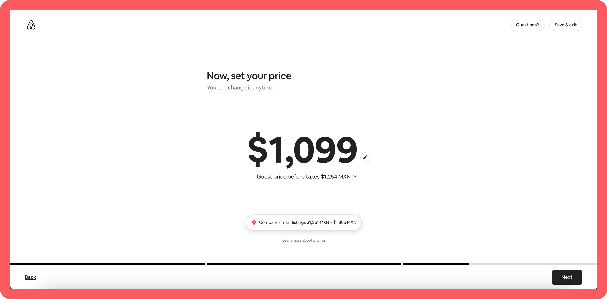
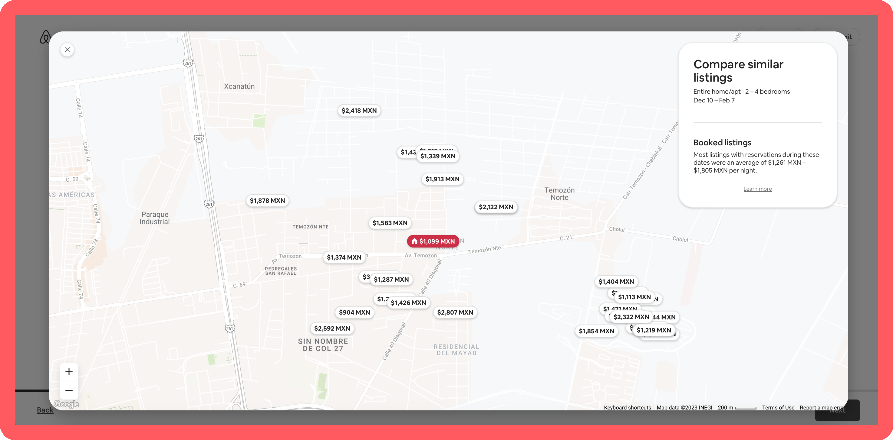
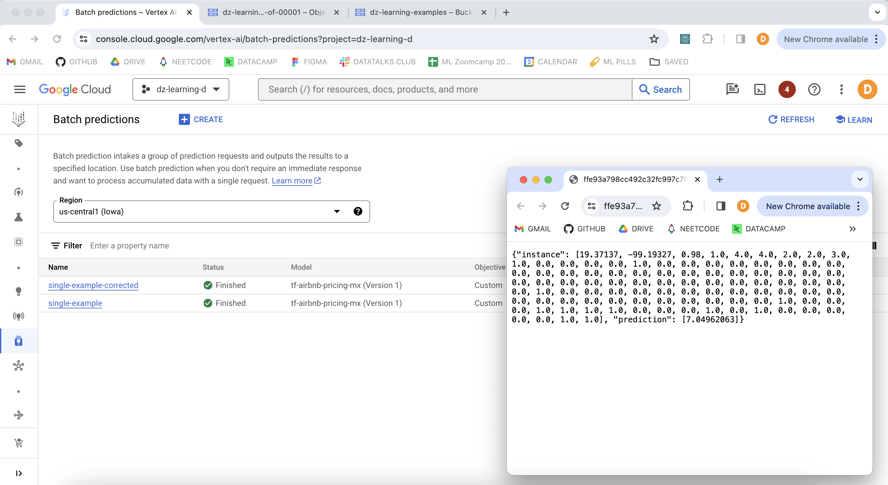
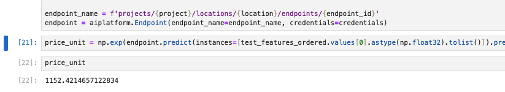

# Machine Learning for Airbnb Pricing in Mexico City! 

In this project, we create and deploy a **TensorFlow Machine Learning model** for pricing recommendations on Mexico City's new Airbnb listings! We deployed the model to a [Vertex AI endpoint](https://cloud.google.com/vertex-ai/docs/model-registry/import-model) and then deployed a Streamlit app that calls that endpoint to display pricing predictions.

[](https://ml-airbnb-pricing-mexico-city.streamlit.app)


## Inspiration story

My grandparents placed a property on Airbnb. How did they select the price? Looking at the houses in the area and selecting a lower base price to be competitive (not taking into account rooms, amenities, descriptions, unit types, etc🤔, just location). So I thought, is location really the only factor that determines the price of a new listing? Airbnb does recommend a base price when creating a new property, but **what are the factors that influence the most that price recommendation?** 

For example, the following would be the recommended price for a new listing. 



You can check the map with the nearest listings as you can see below (but that's it).



Airbnb does mention that to determine prices they use listings that are similar to yours, considering criteria like location, listing type, rooms, amenities, reviews, ratings, etc. So, I decided to use some Airbnb data from Mexico City available on the site [*Inside Airbnb*](http://insideairbnb.com/get-the-data/) (specifically, the dataset corresponding to Mexico City on the quarter June 27th-Sept 22nd, 2023) and train a model where we use `host` and `unit` information to predict a price. **The main objective will be to have the ability to experiment with different listing factors to see how this affects price predictions🧪.**

> ⚡️ This project was done as the final delivery for the [DataTalksClub ML Zoomcamp](https://github.com/DataTalksClub/machine-learning-zoomcamp). I've been completing the course while trying to use in parallel Google Cloud Machine Learning offerings [see the repository: https://github.com/datasciencedani/ml-zoomcamp-gcp].

## Result 

The result of this project is [1] a Tensorflow model trained on Mexico City's Airbnb Data, that uses both host and unit characteristics to predict the listing price, and [2] a [Streamlit](https://streamlit.io) application to interact with the resulting model and be able to experiment with different combinations of variables.


## Understand the project — & steps to run yourself

We will cover step by step the elements of this project that took us to the final result. Additionally, we will write these steps as a comprehensive list for you to be able to reproduce the work done.

### 0️⃣ Set Environment

To run the files in this project (notebooks, training script, and deployment) you will need to:
1. Clone the repository:
    ```
    git clone https://github.com/datasciencedani/ml-airbnb-pricing-mexico-city.git
    ```

1. Ensure environment with `virtualenv`:
    ```
    virtualenv venv
    ```
    ```
    source venv/bin/activate
    ```
    ```
    pip install -r requirements.txt
    ```
1. (for notebooks) Create a jupyter kernell for the environment:
    ```
    python -m ipykernel install --user --name=env-ml-airbnb
    ```

### 1️⃣ Data Cleaning, Exploratory Data Analysis (EDA) & Training — Notebooks

The first thing we did in this project was analyze the data we were using for the rest of our work, clean it, and then perform the necessary exploration to understand how pricing in Mexico City's Airbnb listings work, what are the features that describe a host and its units, and how these features affect the offered price. After having an idea of which features would be important to predict the price, we explored the use of different models and selected the best one for our problem.


You will find  can run the notebooks where we prepare our data for modeling:

1. [Clean the data NB](nbs/00_cleaning.ipynb): In this notebook, we went through the 4 different columns we had on the collected dataset: [1] columns with information about the Airbnb host, [2] columns that describe the location of the scarped units, [3] columns with details of these units, and [4] the column with the price). For each of these categories, we verified/corrected the data types of each column, extracted variables from raw data (such as extracting information from strings with descriptions), and then, selected the features we thought appropriate to analyze further in the EDA.

1. [Exploratory Data Analysis (EDA) NB](nbs/01_eda.ipynb): In this notebook, we went through the variables defined as "label", "numerical", and "categorical", visually analyzed them, and for the last two we observed the relationship between our target variable (price) and these features. You will find justification for the selection of the set of variables we further use to model the price.

1. [Training NB](nbs/02_training.ipynb): In this notebook, we prepare our cleaned dataset for modeling, and then explore different models comparing the performance on validation datasets ([1] Linear regression, [2] NN without preprocessing layers, [3] NN only using location with a preprocessing layer for feature crossing latitude and longitude, and [4] NN with preprocessing layers for normalization and feature cross). We then use a Hyperparameter tuning job to pick the NN architecture (using model [4]) that optimizes the model performance. Once we obtained the best architecture for our model, we trained a final model and tested it, obtaining good results.

### 2️⃣ Training — Script

> **Note:** The ML Zoomcamp is a peer-to-peer evaluation program, for the sake of reproducibility, we followed the practice of having a training script (as shown in the course) and creating a docker image for model predictions. The appropriate approach if working with Google Cloud services would be operationalizing training with a [Vertex pipeline](https://codelabs.developers.google.com/vertex-pipelines-intro#5) instead of a script (with a component to read and clean the data, a component for training with a Vertex custom training job, and a components for model deployment (using Vertex AI model registry and endpoints)). For these steps, you need to set up a cloud environment, the reason for which we will leave it out of this specific project (But stay tuned if you would like to learn more about this!). 

Run the [Training Script](scripts/train.py) by running in terminal:

```
cd scripts 
```

```
python3 train.py 
```

This will create a new folder under the `models` directory (ex. `models/v_20240107184239`). The version is the timestamp of your training and inside you will find the keras file with your model.


### 3️⃣ Explainability — Notebook

In the [Feature Importance NB](nbs/03_feature_importance.ipynb) we explore the use of the [SHAP library](https://github.com/shap/shap) to explain the predictions made by the model. We aim to see how does specific values of our features impact the final prediction of the price of an example Airbnb unit.

We also dive into the limitation of using **SHAP values** to give recommendations to users. For example, if the SHAP variable of a specific amenity is negative and you don't have that amenity, then would including it increase the price? And if you have another amenity, with a lower negative SHAP value, will including it increase the price, but on a lower scale? As you will observe in the notebook, this is not always the case, there are many things we need to consider when interpreting model explanations. SHAP values are valuable to understanding the outputs of our models, but there are still many **complexities in how we use these model interpretations**.

> 🚨 **Note:** when staring this project we thought xAI (Explainable AI) and the use of it was going to be more straightforward, but in the process we noticed the complexities and still lack of research/implementations around this topic (more while working with models as NNs). We will keep the work done on this project as is, but we aim to keep researching on the best ways to interpret and take advantage of model explanation techniques in the future.

### 4️⃣ Deployment & Containerization (run predictions)


In order to test the model in an isolated environment, we created a `dockerfile` to build an image containing the model file and a Flask app to make predictions with this model.

> We created a [Makefile](docker/Makefile) to version control also the commands to interact with docker.

You can individually test the model by running the following commands in your terminal.
1. Move to the appropriate directory:
    ```
    cd docker 
    ```
1. Build the model [docker image](docker/image-model.dockerfile):
    ```
    make build-image-model 
    ```
1. Run the container:
    ```
    make run-image-model-container
    ```
1. And finally, run the prediction test:
    ```
    python3 predict_test.py
    ```
> **Note:** If you can't use the `make` command, try using the commands in the Makefile directly on terminal.

To run the complete service together with the Streamlit app, run:
```
make run-complete-service
```
You will be able to make predictions with the model on the address http://localhost:8501. To shut down the service run:
```
make shutdown
```

### ☁️ Cloud Deployment 

There are two aspects of the deployment of this service that we need to take into account:

1. The cloud deployment of the trained machine learning model.
2. The deployment of the Streamlit application.

For the first part, kindly read the [Cloud Model Deployment NB](nbs/04_cloud_deployment.ipynb) where we leverage the tools offered in ML platforms like Vertex AI, to easily register the model, use it for batch predictions, and deploy it to an online endpoint.

- Batch predictions:
    

- Online Endpoint call:
    

For the second part, of deploying our Streamlit app, we used the public Streamlit Cloud, using app and requirements files from the `streamlit/` directory (see [instructions](https://docs.streamlit.io/streamlit-community-cloud/deploy-your-app)). In order to be able to access the Vertex endpoint from the external app, we added the following text to the Streamlit secrets in "Advanced Settings" (see instructions to obtain this Service Account credentials in the previously referenced [Cloud Model Deployment NB](nbs/04_cloud_deployment.ipynb)):

```toml
[gcp_service_account]
type = "service_account"
project_id = "xxx"
private_key_id = "xxx"
private_key = "xxx"
client_email = "xxx"
client_id = "xxx"
auth_uri = "https://accounts.google.com/o/oauth2/auth"
token_uri = "https://oauth2.googleapis.com/token"
auth_provider_x509_cert_url = "https://www.googleapis.com/oauth2/v1/certs"
client_x509_cert_url = "xxx"
```
> **Note 1️⃣ :** In the real business world, Streamlit is only used for proof of concepts and tests with a small group of users. 

> **Note 2️⃣ :** It is important to decouple the Machine Learning model from any kind of application that uses it. This way, managing the model you use is independet from the application. The Vertex AI platform (as many others similar to it, ex. AWS Sagemaker) is a great place to centralize your machine learning project artifacts (such as models, datasets, metrics, prediction results, and endpoints), also providing a centralized location for the services to ease your work when working with ML. As you can observe, I was able to deploy an online endpoint (with autoscaling, traffic percentage, endpoint monitoring, etc) without dealing with app engines or Kubernetes. That's why we say these platforms offer "managed" services that ease our lives when working with ML.

## Possible next steps

1. Create a Vertex AI pipeline to operationalize training, automatically registering trained models, and deploying with possible performance conditions.

2. **💡 Cool idea:** use also images of the listings as determinants for the price.


## Inspiration Projects

[1] [Data Cleaning and EDA on Airbnb Dataset with Python Pandas and Seaborn](https://towardsdatascience.com/data-cleaning-and-eda-on-airbnb-dataset-with-python-pandas-and-seaborn-7c276116b650) by Soner Yıldırım in Towards Data Science.

[2] Similar project already using Tensorflow, [Predicting New York City rental prices from Airbnb](https://github.com/Timothy102/Tensorflow-for-Airbnb-Prices/blob/main/Rentals.ipynb) on GitHub by Tim Cvetko.